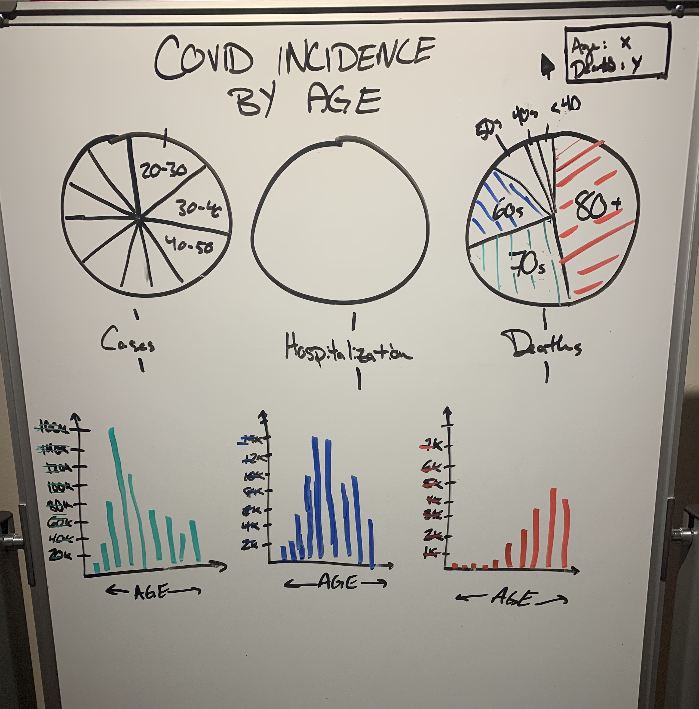
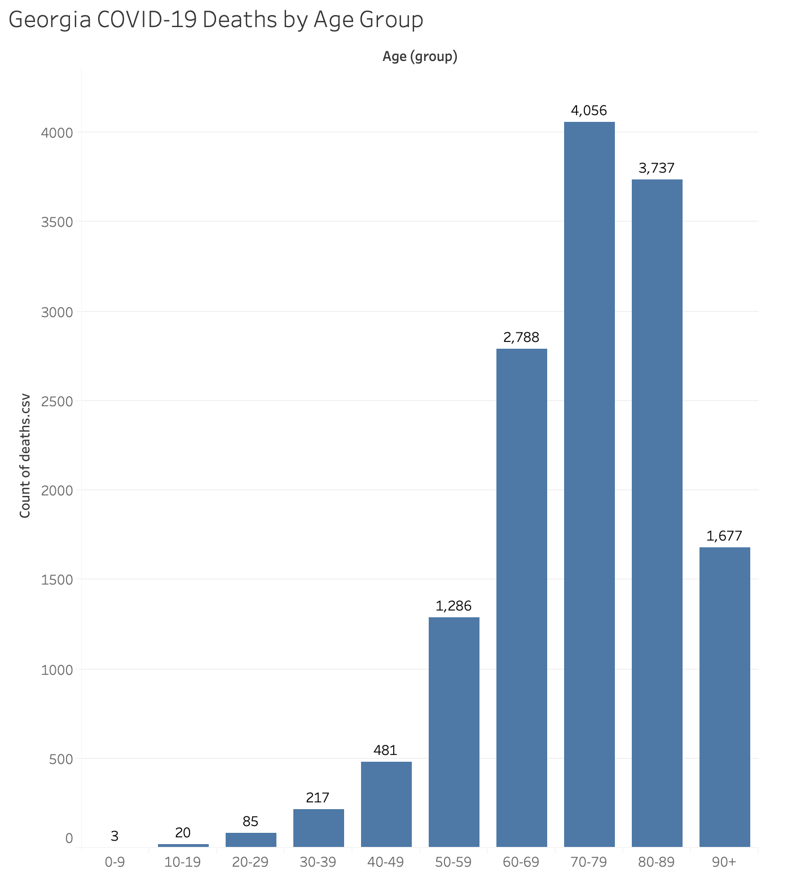

# Georgia
Working through the process of finding visualizations, critiquing them, and then recreating them was challenging. I spent a significant amount of time going through some different news sources and journals that I enjoy before deciding that COVID data is obviously timely and likely to be accessable. I found a dashboard on the Georgia Department of Public Health page that had multiple visualizations and data that paired with it. I chose this vizualisation because I believe it was created to intentionally play down the number of COVID deaths in the state. The scaling on the X axis does not allow for the user to see deaths occuring among younger people, and cases overshadow all of the death data.

My initial brainstorm was that I could represent each outcome (case, hospitalization, death) with a circle, and then fill those circles with the proportion of each age that experienced that outcome. I thought this would create a more balanced view of each of the outcomes, and convey to the viewer which age groups are most at risk. I pitched this inital idea to my roomates and we realized that by leaving out the case numbers I was losing a significant amount of data. We decided that it would be intuitive to simply fix the problem directly and rescale the count axis. I switched the axis to follow more conventional perceptions of bar graphs, and then drew a seperate graph for each outcome. With a new scale, it became much easier to understand the hospitalization and death outcomes that were not viewable on the original visual.

Another thought that I had was that I need to make sure that the changes in scale are noticed by the viewer. This is where I added color to the labels of the Y axis. The text color corresponds with each outcome, bringing the viewers attention to this difference in scale.

I then had to work with the data after realizing that it was incomplete. The zip file from the Georgia DOH only included data on deaths by age, not cumulative case of hospitalization data. I searched through other state health websites, and CDC data but could not find data to complete the rest of the visualization. I created one of the three graphs that would make up the visualization. The real outcome would resemble the bottom white board sketch shown above in brainstorming.
